 


#  Python 自学手册

## 前言

​		**Python**是一门很有趣且实用的计算机语言。Python入门很容易，通过本书的实例学习，可以很轻松地掌握Python的一些基本语法，并且能够编写一些简单的应用程序。

​		**本书内容**：

​		前1~9课为语法部分，使用交互解释器学习python语言的基本语法。

​		后10~20课为应用部分，使用编辑器编写小段程序，掌握常用的python内置函数、模块和库。

​		**学习建议**：

​		编程通俗地讲，就是书写处理字符串和数字的代码。本书作为自学手册，有很多概念和描述不够细致，不能单独作为入门教程来使用，请初学者阅读相关基础教程，配合使用最佳。本书缺少数据库、视觉识别、科学计算方面的介绍，主要是因为难度太深，需要更多相关知识支持，不适合入门学习。本书使用Thonny IDE工具学习Python，所以不再细数Python自带的IDLE、Pycharm edu版和VsCode编辑器等。


笔名：温州水乡 信息技术教师  2020年2月8日  版权保留，请勿转载！

众志成城，抗击疫情，万众一心，春暖花开！

在线阅读 https://github.com/WaterCountry/Pyhandbook/Python自学手册.md

----


[toc]


# 预备课 Python语言简介


## 计算机语言
**计算机语言概念**
		计算机语言（programming language），就是指计算机能够理解并接受执行，具有一定语法规范的语言。
		计算机语言从诞生起共经历了机器语言、汇编语言和高级语言三个阶段。
		**机器语言**是用符号0和1二进制代码表示计算机能直接识别和执行的机器指令集合。
		**汇编语言**是一种用助记符mov、add、push等代替0和1二进制机器指令，便于记忆和书写的集合，被称作低级语言。
		**高级语言**是相对于汇编语言而言，更类似人类自然语言的指令集合语言。像Python、Java、PHP、C#、Basic、C++、C 等等都是高级语言。

## Python语言
**Python起源**
		Guido van Rossum（吉多·范罗苏姆）是Python编程语言的创始人。出生于荷兰哈勒姆，数学计算机双硕士，现居美国，曾就职于Google公司。1989年圣诞节期间，在阿姆斯特丹，为了打发无聊的圣诞假期，决心开发一个新的脚本解释程序，作为ABC语言的一种继承。因为迷恋BBC幽默剧《Monty Python飞行马戏团》，为了纪念喜剧天才Monty Python，于是将这门语言命名为Python。


**Python应用场景**
​		Python的应用十分广泛，包括WEB开发、桌面软件、网络编程、爬虫开发、云计算开发、人工智能、自动化运维、金融分析、科学运算、游戏开发，甚至火星探测，搜索引擎，引力波分析等众多领域。

## Python环境配置
​		一款好用的编辑器对编写与调试代码来说，都非常重要。
​		Python自带IDLE交互解释器，还可以使用免费的Pycharm社区版或教育版，以及微软出品的Visual Studio Code轻量级代码编辑器和网页版jupyter notebook等进行学习编写。

**Thonny编辑器**

​		Thonny 是一个特别适合初学者及教学的 Python IDE，由爱沙尼亚的Tartu 大学开发，它采用了不同的方法，调试器是专为学习和教学编程而设计，并集成python3最常用的库。
​		Thonny IDE官网地址为：http://thonny.org 
​		Thonny-xxl集成版下载网址为：https://github.com/thonny/thonny/releases/  

**Thonny界面**：菜单、工具栏、代码编辑器、Shell交互解释器

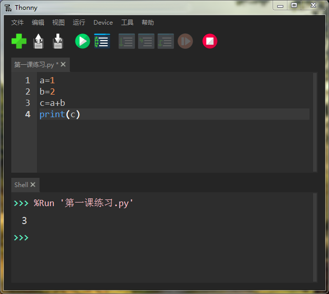

**Thonny常规配置**


**Thonny主题配置**


**Thonny集成库**

​		如果要补充更多的学习库，请从菜单工具里打开系统shell，然后在命令行中输入安装语句：

​		pip install 库名称

​		本书预计要安装以下学习库

​		pip install pyttsx3
​		pip install pillow
​		pip install matplotlib
​		pip install pandas
​		pip install bottle

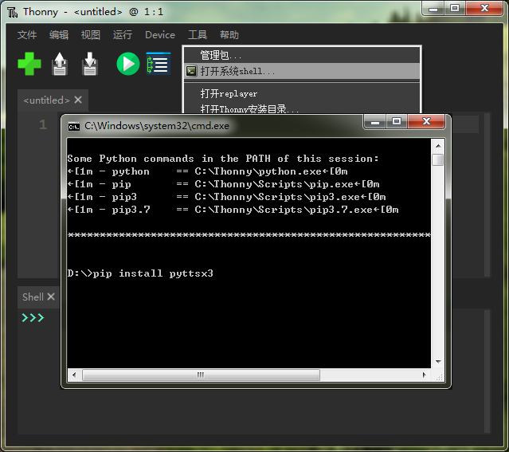


**特别说明**
		本书指定使用Thonny-xxl版，基础知识编排参考Python官网文档目录，概念参考官网文档和网上中文资料，本书使用Markdown编辑器Typora编写而成，借此对所有学习资料提供者，表示深深的感谢！ 


------


# 第一课 数学计算器


## 1.1启用Python解释器
​		打开**Thonny**即可启用自带Python交互式解释器Shell。
​		如图输入1+2 后按回车，立即输出结果 3 。


## 1.2 数字运算
​		解释器就像一个简单的计算器一样：你可以在里面输入一个表达式然后它会写出答案。
​		表达式的语法很直接：运算符 +、-、* 、/  和我们数学中的一模一样。
​		同样也可以使用括号（）来进行优先运算。计算乘方在Python中可以使用 ** 运算符。

```python
>>> 1+2
3
>>> 10-3*2
4
>>> (10-3*2)/4
1.0
>>> 6/5
1.2
>>> 3**2
9
```

​		整数（比如 2、4、20 ）的类型是 int，有小数部分的（比如 1.0、1.2 ）的类型是 float。
​		除法运算 /  永远返回浮点数类型。
​		如果要得到一个整数结果（忽略小数部分）你可以使用 // 运算符；如果要计算余数，可以使用 %取模

```python
>>> 17/3
5.666666666666667
>>> 17//3
5
>>> 17%3
2
>>> 5*3+2
17
>>> 1.5*2
3.0
>>> 1.5*2+4
7.0
```

## 1.3变量运算
​		等号 = 用于给一个变量赋值。然后在下一个交互提示符之前不会有结果显示出来。
​		变量通常用英文字母表示，Python3也支持中文变量。
​		譬如，一个教室的长为10米，宽度为5米，求教室面积多少？

```python
>>> 长=10
>>> 宽=5
>>> 长*宽
50
>>> a=10
>>> b=5
>>> a*b
50
```

​		如果一个变量未赋值，使用它时，会向你提示错误，因为无法进行运算。
​		使用变量前，我们要对它进行赋值或给定一个初始值，通常数字 变量=0 作初始值。

```python
>>> n
Traceback (most recent call last):
  File "<pyshell>", line 1, in <module>
NameError: name 'n' is not defined
```

​		在交互模式下，变量会一直保持原来的值，除非你再重新赋值。这意味着当某个变量有变化时，仍然可以使用原先计算式进行重新计算。

​		早餐店的小饭团每个3元，小明买五个需要多少钱？后来饭团的价格每个提高了1元钱，现在小明同样买五个小饭团，需要多少钱？

```python
>>> price=3
>>> number=5
>>> price*number
15
>>> price=price+1
>>> price*number
20
```

```python
>>> 价格=3
>>> 数量=5
>>> 价格*数量
15
>>> 价格=价格+1
>>> 价格*数量
20
```


------


# 第二课 字符串处理


## 2.1 字符串显示和连接
​		除了数字，Python 也可以操作字符串。字符串有多种形式，可以使用单引号（'Hello'），双引号（"Hello"）都可以获得同样的结果 。

```python
>>> 'Hello'
'Hello'
>>> "我爱中国"
'我爱中国'
>>> "I'm Chinese."
"I'm Chinese."
```

​		 相邻的两个或多个 字符串将会自动连接到一起，也可以用 + 进行连接（粘到一起）

```python
>>> 'ni''hao'
'nihao'
>>> 'ni'+'hao'
'nihao'
>>> '我'+'是'+'中国人'
'我是中国人'
```

​		可以用 * 进行重复字符串

```python
>>> 'good '*3
'good good good '
>>> "中国梦"*3
'中国梦中国梦中国梦'
>>> '12345'*3
'123451234512345'
```

## 2.2 字符串索引
​		字符串是可以被 索引 （下标访问）的，第一个字符索引是 0。单个字符并没有特殊的类型，只是一个长度为一的字符串。

```python
>>> word='China'
>>> word[0]
'C'
>>> word[4]
'a'
```

​		 索引也可以用负数，这种会从右边开始倒数。注意 -0 和 0 是一样的，所以负数索引从 -1 开始。

```python
>>> word='我的中国心'
>>> word[-1]
'心'
>>> word[-5]
'我'
```

## 2.3 字符串切片
​		字符串还支持 切片。索引可以得到单个字符，而 切片 可以获取子字符串。
​		word [ 开始的索引号，字符长度]

```python
>>> word='我的中国心'
>>> word[0:2]
'我的'
>>> word[2:5]
'中国心'
>>> word[:2]
'我的'
>>> word[2:]
'中国心'
```

  

  +-----+-----+-----+----+----+
  | 我 | 的 | 中 | 国 | 心 | 
  +-----+-----+-----+----+----+
      0      1       2     3     4   

​		 使用过大的索引会产生一个错误：

```python
>>> word[5]
Traceback (most recent call last):
  File "<pyshell>", line 1, in <module>
IndexError: string index out of range
```

​		内建函数 len() 返回一个字符串的长度：

```python
>>> word="路漫漫其修远兮，吾将上下而求索。"
>>> len(word)
16
```


------


# 第三课 数据类型

Python使用赋值的方式创建变量，未赋值的变量是无法使用的。

Python变量直接赋值各种类型的数据。常用的数据类型有数字整型int、数字浮点型、字符串str、布尔值bool、列表list、元组tuple、字典dict等。

存储相同类型数据的变量可以做运算，不同类型的变量无法直接运算。

## 3.1数字类型
​		int整型、float浮点型

```python
>>> a=1
>>> b=2
>>> c=a+b
>>> c
3
>>> d=a/b
>>> d
0.5
>>> e=a+d
>>> e
1.5
```

## 3.2字符串类型

**字符串**使用英文单引号或双引号表示，如 'hello' 或 "world" ，特别注意**不可以用中文引号**。

```python
>>> word='good luck'
>>> word
'good luck'
>>> phone='12345678900'
>>> phone
'12345678900'
>>> chinese='我爱我的祖国'
>>> chinese
'我爱我的祖国'
>>> 
```

## 3.3布尔类型
​		布尔值只有True 和 False。与其他数据类型做 and、or、not运算（与、或、否运算）时，会把0、空字符串和None看成 False，其他数值和非空字符串都看成 True。

```python
>>> a=True
>>> b=False
>>> a
True
>>> b
False
>>> a and b
False
>>> a or b
True
>>> not a
False
>>> not b
True
```

## 3.4复合数据类型
## 列表
​		Python 中可以通过方括号括起、逗号分隔得到一组数据列表。一个列表可以包含不同类型的元素，但通常使用时，各个元素类型保持相同，方便存取。

```python
>>> money=[3,4,8,5,7,6]
>>> money
[3, 4, 8, 5, 7, 6]
>>> money[0]
3
>>> money[-1]
6
>>> money[2:]
[8, 5, 7, 6]
>>> save=[1,4,5,3,2,0]
>>> money+save
[3, 4, 8, 5, 7, 6, 1, 4, 5, 3, 2, 0]
```

​		列表是一个可变类型，就是说，它自己的内容可以改变:

```python
>>> money=[3,4,8,5,7,6]
>>> money
[3, 4, 8, 5, 7, 6]
>>> money[0]=22
>>> money
[22, 4, 8, 5, 7, 6]
```

​		列表可以切片赋值，或者整个清空

```python
>>> word=['我', '热爱', '祖国']
>>> word+['山川', '河流', '田野']
['我', '热爱', '祖国', '山川', '河流', '田野']
>>> word[1:3]=['喜爱','家乡']
>>> word
['我', '喜爱', '家乡', '山川', '河流', '田野']
>>> word=[]
>>> word
[]
```

​		列表的方法：
​				添加元素   list.append('元素')
​				移除元素   list.remove('元素')
​				列表排序   list.sort()

```python
>>> word=['我','爱','你']
>>> word.append('中国')
>>> word
['我', '爱', '你', '中国']
>>> word.remove('你')
>>> word
['我', '爱', '中国']
>>> m=[3,1,9,7,5]
>>> m.sort()
>>> m
[1, 3, 5, 7, 9]
```

​		内置函数 len() 也可以作用到列表上:

```python
>>> word=['我', '热爱', '祖国']
>>> len(word)
3
```


----


# 第四课 表达式


## Python表达式
​		python表达式是值，变量和操作符(或叫运算符)的组合。
​		单独的一个值是一个表达式，单独的变量也是一个表达式。
​		Python代码就是由表达式和语句组成，并由Python解释器负责执行。

## 4.1算术表达式
​		算术运算符包括+, -, *, /, //, **, ~, %
​		分别表示 加、减、乘、除、整除、乘方、取补、取模

```python
>>> a=1
>>> b=2
>>> c=3
>>> a+b
3
>>> b**c
8
>>> (a+b)*c
9
```

## 4.2比较表达式
​		比较运算符包括>, <, ==, !=, <=, >=用于比较两个表达式的值
​		分别表示大于、小于、等于、不等于、小于等于、大于等于。

```python
>>> a>b
False
>>> b<c
True
>>> a+b==c
True
>>> a!=b
True
```

## 4.3逻辑表达式
​		逻辑运算符包括and, or, not表示逻辑运算

```python
>>> x=True
>>> y=False
>>> x and y
False
>>> x or y
True
>>> not x
False
```

## 4.4身份表达式
​		身份运算符包括is, is not

```python
>>> a is b
False
>>> a is not b
True
```

## 4.5成员运算符
​		成员运算符包括 in, not in
​		判断特定的值 包含 或 不包含 在列表里。

```python
>>> word='hello'
>>> 'e' in word
True
>>> 'f' in word
False
>>> nums=[1,2,3,4,5,6]
>>> 1 in nums
True
>>> 0 not in nums
True
```


----


# 第五课 输出输入


## 5.1 Print输出函数
​		使用格式： print(内容)
​		内容可以是数值、字符串、各种类型的变量或表达式，以及更漂亮的格式化控制输出。

```python
>>> print(2020)
2020
>>> print('新年快乐!')
新年快乐!
>>> words=['每天','都是','新的开始。']
>>> print(words)
['每天', '都是', '新的开始。']
>>> a='我'
>>> b='是'
>>> c='中国人'
>>> print(a,b,c)
我 是 中国人
>>> print(a+b+c)
我是中国人
>>> n=2
>>> print(n+3)
5
```

​		要使用更漂亮格式化字符串输出 ，请在字符串的开始引号之前加上一个 f 或 F 。
​		在此字符串中，你可以在 { 和 } 字符之间写可以引用的变量或Python 表达式。

```python
>>> year=2020
>>> words='新年快乐！'
>>> print(f'热烈庆祝{year}{words}')
热烈庆祝2020新年快乐！
```

​		字符串内换行（\n）和重复输出（*重复次数）

```python
>>> print('我爱北京\n天安门')
我爱北京
天安门
>>> print('中国梦'*3)
中国梦中国梦中国梦
```

## 5.2 Input输入函数
​		使用格式：input(提示语)
​		提示语内容可以为空或者字符串、变量内容。
​		可以将input输入赋值给一个变量，以获得输入内容。

```python
>>> input()
good
'good'
>>> input('你叫什么名字?')
你叫什么名字?张三
'张三'
>>> like=input('你的兴趣爱好是什么？')
你的兴趣爱好是什么？看书
>>> print(like)
看书
```

​		默认输入得到的是一个字符串，如果想得到数字，需要使用int()强制整型转换或eval()去引号。

```python
>>> input('你的年龄是多少？')
你的年龄是多少？18
'18'
>>> int(input('你的年龄是多少？'))
你的年龄是多少？12
12
>>> eval(input('你的年龄是多少？'))
你的年龄是多少？8
8
```

## 例题：
​		请编写一段程序，询问用户的年龄，根据输入的年龄，通过计算输出用户的出生年份？

```python
thisYear=2020
age=int(input('请输入你的年龄？ '))
birthYear=thisYear-age
print('你的出生年份是：',birthYear)
```

## 练习：
​		请参考例题按如下次序，编写一段购物小程序：
​		1、输出“老好吃包子店，欢迎光临！”
​		2、设定包子的价格price
​		3、输出“包子价格：price  元/个”
​		4、询问“请问，您需要几个包子数？”number
​		5、计算总价cost
​		6、输出“您一共购买 number 个包子，花费 cost 元。”

```python
price=2
print('老好吃包子店，欢迎光临！')
print(f'包子价格：{price}元/个')
number=int(input('请问，您需要几个包子数？ '))
cost=number*price
print(f'您一共购买{number}个包子，花费{cost}元。')
```


----


# 第六课 流程控制


## 流程控制就是指程序运行的顺序。
​		通常分为三类：顺序结构、分支结构和循环结构。

## 6.1顺序结构
​		顺序结构是按从上到下的顺序去执行代码。
​		**编程实现**：询问输入第一个数字，再询问输入第二个数字，计算两数之和，输出和。

```python
a=int(input('请输入第一个数字：'))
b=int(input('请输入第二个数字：'))
c=a+b
print(f"{a}加{b}等于{c}")
```

## 6.2分支结构
​		分支结构是根据条件判断来确定是否执行代码。
​		**编程实现**：询问输入一个整数，判断后输出是奇数还是偶数。

```python
n=int(input('请输入一个整数：'))
if n%2==0:
    print(n,'是偶数')
else:
    print(n,'是奇数')
```

## 6.3循环结构
​		循环结构是按一定的条件反复执行代码。
​		**编程实现**：请依次输出10以内的自然数

```python
while 条件表达式：
    执行的代码
```

```python
n=1
while n<11:
    print(n)
    n=n+1
```

```python
for 变量 in 列表：
    执行的代码
```

```python
for n in range(1,11):
    print(n)
```

## 6.4 Python缩进

​		Python语言对代码缩进有非常严格的要求，同一级别的代码缩进必须一致。不同级的代码必须缩进4个空格，我们可以使用键盘上的Tab制表键来快速缩进。
​		If条件语句、while条件语句、for条件语句里面的执行语句都要缩进4个空格，并保持一致。我们后面将学习的函数内部的语句也都要缩进4个空格。**仔细观察，你会发现所有要缩进的语句前面都有：冒号**。

----


# 第七课 If 语句


## 7.1 If 语句的基本形式：
```python
if 判断条件：
    执行语句
else：
    执行语句…
```

​		其中"判断条件"成立时（非零），则执行后面的语句。
​		else 为可选语句，当需要在条件不成立时执行内容则可以执行相关语句。

​		

## 例题：
​		**编程实现**：输出”成绩管理系统“，询问”请输入你的访问密码：“，如果密码正确，输出”密码正确，你可以访问!“，否则输出”密码错误，请重新输入!“。

```python
print('成绩管理系统')
password=input('请输入你的访问密码:')
if password=='123456':
    print('密码正确，你可以访问!')
else:
    print('密码错误，请重新输入!')
```

## 练习：
​		**编程实现**：设计一个谜语问答程序，输出谜题，询问谜底，如果正确输出“恭喜您，答对了！”，否则输出“回答错误，请继续努力！”


## 实践：
​		**编程实现**：输出程序标题“猜数字”，询问“请输入一个数字：”，如果大于某数字输出“您猜大了！”，否则输出“您猜小了！”，如果相等输出“恭喜，您猜对了！”

```python
print('猜数字')
number=int(input('请输入一个数字：'))
if number>18:
    print('你猜大了！')
elif number<18:
    print('你猜小了！')
else :
    print('恭喜你，答对了！')
```

## 应用：
​		**编程实现**：体重指数(BMI)的计算方法是：BMI=体重(千克)/身高的平方(米)。
专家建议，中国人体重指数的最佳值应该是20-22，BMI大于22.6为超重，BMI大于30为肥胖，低于18为偏瘦。例如，你的体重指数为:BMI=55公斤/(1.65×1.65)=20.2，BMI在正常范围,符合健康标准。


----


# 第八课 For语句


## 8.1 for语句用法：
​		Python 中的 for 语句并不总是对算术递增的数值进行迭代，而是对任意序列进行迭代（例如列表或字符串），迭代顺序与它们在序列中出现的顺序一致。
​		用法：  for  变量 in 数据序列：
## 例题：
​		**编程实现**：输出标题”拆单词“，询问”请输入一个单词“，输出单词里的每一个字母。

```python
print('拆单词')
word=input('请你输入一个单词：')
for c in word:
    print(c)
```

## 练习：
​		**编程实现**：输出标题”拆句子“，询问”请输入一段中文句子“，定义一个列表，遍历句子中的每一个汉字，并将每个汉字分别存储到列表中，然后输出列表。


## 8.2 range函数
​		如果你需要遍历一个数字序列，内置函数 range() 会派上用场，它会生成算术级数。
​		**编程实现**：输出10以内的自然数

```python
for n in range(10):
    print(n)
```

​		range也可以从某个数字开始，到某个数字终止。但给定的终止数值并不在要生成的序列里。

```python
for n in range(1,5):
    print(n)
```

​		range还可以用指定的数值增加或减少（有时这也被叫做幅度或步进）。

```python
for n in range(1,20,5):
    print(n)
```

## 例题：
​		**编程实现**：使用for 语句和range函数，输出20以内的偶数序列

```python
for n in range(2,20,2):
    print(n)
```

​		**模仿练习**：使用for 语句和range函数，输出20以内的奇数序列

## 应用：
​		**编程实现**：输出标题”高斯求和“，使用for 语句和range函数自动计算从1到100所有数之和并输出。

```python
print('高斯求和')
s=0
for n in range(1,101):
    s=s+n
print(f'从1到100所有自然数之和：{s}')
```

## 探究：

​		"水仙花数"是指一个三位整数的自幂数，其各位数字的3次方和等于该数本身。（1^3 + 5^3+ 3^3 = 153）‪‬‪‬‪‬‪‬‮‬‭‬‪‬‪‬‪‬‪‬‪‬‪‬‮‬‭‬‫‬‪‬‪‬‪‬‪‬‪‬‮‬‫‬‮‬‪‬‪‬‪‬‪‬‪‬‮‬‫‬‮‬‪‬‪‬‪‬‪‬‪‬‮‬‭‬‫‬
​		编程实现：通过阅读，请用程序计算搜索10000以内的水仙花数并输出。

```python
print("100-1000之间的水仙花数有：")
for i in range(100, 1000):
    j = int(i / 1 % 10)  # 取个位 
    k = int(i / 10 % 10)  # 取十位
    m = int(i / 100 % 10)  # 取百位

    if i == (j ** 3 + k ** 3 + m ** 3):
        print(i)
```

请查阅有关自幂数的资料，用编程方式计算搜索其他的自幂数。

----


# 第九课 While语句


## 9.1 while语句用法:
​		循环语句是在满足一定条件下重复执行某段程序，直至条件不满足为止。
​		给定的条件称为循环条件，反复执行的程序段称为循环体。
```python
while 条件表达式：
    执行的代码
```


## 例题一
​		**编程实现**： 重复询问‘请输入密码’，如果正确则输出‘密码正确’并结束询问，否则输出‘密码错误’。

```python
while True:
    word=input("请输入密码：")
    if word =='123':
        print('密码正确！')
        break
    else:
        print('密码错误！')
```

## 例题二
​		**编程实现**： 使用while语句统计1到100自然数之和。

```python
n=1
s=0
while n<=100:
    s=s+n
    n=n+1
print(s)
```

## 探究
​		斐波那契数列（Fibonacci sequence）。1202年，意大利数学家Leonardo Fibonacci提出了这样一个问题：在最佳条件下，一年里，一对兔子能繁殖多少对兔子？ 这个理论实验规定，母兔总是生下成对的兔宝宝，每对由一公一母组成。每个月的兔子对数：1，1，2，3，5，8，13，21，34，55，89，144。这个数列从第3项开始，每一项都等于前两项之和，这个数列被命名为斐波那契数列，又称黄金分割数列。

**编程实现**：请输出100以内的斐波那契数列

```python
print('斐波那契数列')
a=1
b=1
print(a)
print(b)
while a+b<100:
    c=a+b
    a=b
    b=c 
    print(c)   
```

病毒传播速度：某病毒的传播率为2，请查阅资料使用编程方式预测30天内理论上的传播趋势数列？

----


# 第十课 import导入模块


## 10.1 模块的概念：
**模块**：将一组功能相关的代码写入一个单独的.py文件中，需要时进行导入，这个文件就是模块。
**包**：有层次的文件目录结构，内部有多个模块或多个子包，一般要有__init__.py这个文件
**库**：完成一定功能代码的集合，完成的功能一般更加广泛，可以是模块，也可以是包。

## 10.2 随机数模块random
​		random.random()函数生成一个随机的浮点数，范围是在0.0~1.0之间。

```python
import random

random.random()
```

​		random.randint()随机生成一个整数int类型，可以指定这个整数的范围。
​		使用方法：random.randint(2，9) 表示生成包含数字2到9范围内的一个随机整数。
​		编程实现：随机点名（1-40名同学序号）

```python
import random

while True:
    n=random.randint(1,40)
    print('随机选取学号为：',n)
    word=input('你打算重新选取吗y/n?')
    if word is 'n':
        break
```

​		random.choice()可以从任何序列，比如列表、字符串等中选取一个随机的元素返回。
​		使用方法：random.choice('A','B','C','D','E')表示生成包含A到E范围内的一个随机序列元素。
​		**编程实现**：石头剪子布游戏

```python
import random

list=['石头','剪刀','布']
print('石头剪子布游戏')
while True:   
    print('—'*15) 
    word=input('请选择（石头、剪刀、布）：')
    computer=random.choice(list)
    print(f'计算机选择{computer}，你选择{word} ')
    if word==computer:
        print('你猜对了！')
    else:
        print('你猜错了！')
```

## 10.3 时间模块time
​		使用time.sleep(秒)可以让程序休眠一段时间，以秒为单位，可以是小数。
​		**编程实现**：时间提醒器（每隔五秒，提醒一次）

```python
import time

print('时间提醒器')
while True:
    time.sleep(5)
    print('已经过五秒钟了')
```

## 10.4 其他模块
​		常用的内置模块包括日历模块calendar、系统模块sys和os 、xml标记语言模块等

```python
import sys

sys.version
```

```python
import os

os.getcwd()
```


----


# 第十一课 函数


## 11.1什么是函数
​		函数是指将一组单一功能的代码，通过一个名字封装起来，要想执行这个函数，只需调用其函数名即可。函数能提高代码重复利用率和应用的模块性。

## 11.2定义函数
​		关键字 def 引入一个函数 定义。它必须后跟函数名称和带括号的形式参数列表。
​		构成函数体的语句从下一行开始，并且必须缩进四个空格。

​		定义函数的格式：
```python
def 函数名(形式参数):
	函数体
	return 返回值
```


**定义一个加法函数**：

```python
def add(a,b):
    result=a+b
    return result

#add加法函数使用方法
add(5,3)
```

>  8

**定义一个欢迎函数**：

```python
def hello(name):
    say=f'欢迎{name}同学来到我们的课堂。'
    return say

#hello欢迎函数使用方法
hello('小明')
```

> 欢迎小明同学来到我们的课堂。

**定义一个数列求和函数**：S(n)=1+2+3+...+n

```python
def sn(n):
    result=0
    for i in range(1,n+1):
        result=result+i
    return result

#sn数列求和函数使用方法
sn(100)
```

> 5050

## 综合练习

**编程实现**：请使用函数来编写一个简单的打字程序

基本功能：

运行后，出来欢迎词“欢迎使用TT打字练习！”

显示菜单说明，输入TT表示开始打字，输入QT表示退出打字

接着显示英文单词或中文词语

如果输入正确，计数并显示下一个单词

退出时，显示打字速度，每分钟多少个单词，根据速度做出成绩等级评价


---


# 第十二课 加密函数


## 加密的概念

​		加密：以某种特殊的算法改变原有的信息数据，使得未授权的用户即使获得了已加密的信息，但因不知解密的方法，仍然无法了解信息的内容。
​		加密之前的原始报文称为明文，加密之后的报文叫密文。

## 12.1 最早的密码 
​		公元前19世纪，古代埃根据身边的动植物等东西发明了象形文字，公元前1900年左右建造了一块石碑，上面使用的象形文字，被认为是最古老的密码。 


​		中国的象形文字就是甲骨文，起源于商朝时期，约公元前17世纪，距今约3600多年的历史。


## 12.2 换位密码
​		公元前十三世纪，在旧约圣经中也使用了密码。其中之一是希伯来语的換字密码，它在文字上加上号码，从最初的顺序和末尾进行替换。在将字母26文字作为暗号的情况下，将A作为Z，以B为Y，按照这样的顺序进行替换制作。

​		**编写实现**：将一段句子中文字进行前后调换位置，形成简单的换位密文

```python
def encryp(word):
    #文字加密函数
    listword=list(word)
    n=len(listword)
    m=n//2
    for i in range(m):
        listword[i],listword[n-1-i]=listword[n-1-i],listword[i]
        
    result=''.join(listword)
    return result

word=input('请输入一段文字：')
enword=encryp(word)
print('换位之后的文字：',enword)
```

## 12.3 凯撒密码
​		古代罗马将军尤里斯·凯撒（恺撒大帝，公元前100 ~ 44年）使用的密码，并列两排文字，然后用代换的方法。在这种密码中，从A到W的每个字母在加密时用字母表中位于后三位的那个字母代替，字母XYZ分别被替换成abc。譬如在三个移位的情况下，信息BOY就变换成erb；密文girl对应的明文则是DFOI。
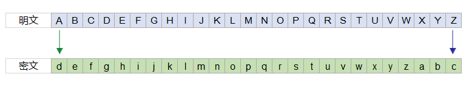

你能编写一段程序，用凯撒密码的加密方式，给英文句子加密吗？		


## 12.4 python加密库

## Base64加密和解密
​		Base64是一种用64个字符来表示任意二进制数据的加密方法。Base64编码可以称为密码学的基石。可以将任意的二进制数据进行Base64编码。所有的数据都能被编码为并只用65个字符就能表示的文本文件。

```python
import base64

word='健康快乐'
result=base64.b64encode(word.encode('utf8'))     #加密
print(result)

decode=base64.b64decode(result)                  #解密
print(decode.decode('utf8'))
```

## MD5加密
​		message-digest algorithm 5（信息摘要算法）。
​		md5其实就是一种算法。可以将一个字符串，执行md5运算后，就可以生成一个固定长度为128bit的串。md5为不可逆算法。

```python
import hashlib

word='节日快乐！'
hb=hashlib.md5()             # 创建md5对象
hb.update(word.encode())     # md5加密运算

print(word)
print(hb.hexdigest())
```


----


# 第十三课 文本转语音库


## 13.1 文本转语音库 Text to Speech (TTS) library

Python中实现文本转语音可以使用讯飞开放平台、百度AI开放平台，还可以使用最方便简单pyttsx3语音库。

**安装方法**
pip install pyttsx3

## 13.2 文字朗读

```python
import pyttsx3                     #导入语音引擎库

text='春眠不觉晓，处处闻啼鸟。'
voice=pyttsx3.init()               #初始化并启用语音引擎
voice.say(text)					   #文本转语音
voice.runAndWait()                 #运行并等待，完成语音转换
```

getProperty('属性')          获取相应属性数值

setProperty('属性',数值)  设置相应属性数值

常用的属性包括：语速 rate    音量 volume 等 

控制语速（调节频率）

```python
import pyttsx3

text='春眠不觉晓，处处闻啼鸟。'
voice=pyttsx3.init()
#rate = voice.getProperty('rate')   #读取语速数值
#print(rate)                        #去注释可以查看默认语速数值是200
voice.setProperty('rate', 160)
voice.say(text)
voice.runAndWait()
```


## 13.3 词语列表朗读：

```python
import pyttsx3

word=['boy','girl','男孩','女孩','天气预报','今天的气温0到10摄氏度']
voice=pyttsx3.init()
for s in word:    
    voice.say(s)
    voice.runAndWait()
```


----


# 第十四课 文件读写


## 14.1 python内置open函数提供文件对象的操作
​		文件句柄 = open('文件路径', '模式'，编码方式)
​		模式：
​		r    以只读方式打开文件。这是默认模式，文件必须存在，不存在则抛出错误。
​		w    打开一个文件只用于写入。如果该文件已存在则将其覆盖。如果该文件不存在，创建新文件。

## 文本读取：新闻朗读

```python
import pyttsx3

f= open('data/news.txt','r',encoding='utf-8')  #打开data目录中news.txt文件
text=f.read()                                  #读取文件
f.close()                                      #关闭文件

print(text)

voice=pyttsx3.init()
voice.say(text)
voice.runAndWait()
```

## 文本写入：歌词录入

```python
f=open('song.txt','w',encoding='utf-8')      #打开文件
text='''
我的中国心
歌手：张明敏
河山只在我梦萦
祖国已多年未亲近
可是不管怎样也改变不了
我的中国心
洋装虽然穿在身
我心依然是中国心
我的祖先早已把 我的一切
烙上中国印
'''
f.write(text)                                #将text文本内容写入文件
f.close()                                    #关闭文件
```


----


# 第十五课 表格处理


## 15.1 Pandas工具集
​		**Pandas**是一个强大的分析结构化数据的工具集，其提供的**read_excel()** 和**to_excel()**能够方便高效地进行excel文件的读写。pandans依赖处理Excel的xlrd模块，需要提前安装。生成表格失败时，请注意是否安装openpyxl模块。
​		安装命令：
​		pip install pandas
​		pip install xlrd
​		pip install openpyxl

## 15.2 探究

​		请准备一份跟下面一样的表格文档：成绩单.xlsx

​		然后依次在交互式解释器中输入代码，检验并理解 pandas库各函数使用方法。

```python
import pandas as pd                    #导入Pandas库

df=pd.read_excel('成绩单.xlsx')        #读取excel表格文件，默认读取第一张工作表
```

​		df 获取表格数据：

|      | 姓名 | 性别 | 语文 | 数学 | 总分 |
| ---- | ---- | ---- | ---- | ---- | ---- |
| 0    | 孙一 | 男   | 100  | 95   | NaN  |
| 1    | 吕二 | 男   | 90   | 85   | NaN  |
| 2    | 张三 | 男   | 80   | 75   | NaN  |
| 3    | 李四 | 女   | 70   | 65   | NaN  |
| 4    | 王五 | 女   | 60   | 55   | NaN  |
| 5    | 陈六 | 男   | 50   | 45   | NaN  |
| 6    | 周七 | 女   | 40   | 35   | NaN  |
| 7    | 沈八 | 女   | 30   | 25   | NaN  |
| 8    | 赵九 | 男   | 20   | 15   | NaN  |
| 9    | 钱十 | 男   | 10   | 5    | NaN  |

```python
df.语文                                #显示语文列数据
```

> 0    100
> 1     90
> 2     80
> 3     70
> 4     60
> 5     50
> 6     40
> 7     30
> 8     20
> 9     10
> Name: 语文, dtype: int64

```python
df.总分=df.语文+df.数学                 #求总分
```

|      | 姓名 | 性别 | 语文 | 数学 | 总分 |
| ---- | ---- | ---- | ---- | ---- | ---- |
| 0    | 孙一 | 男   | 100  | 95   | 195  |
| 1    | 吕二 | 男   | 90   | 85   | 175  |
| 2    | 张三 | 男   | 80   | 75   | 155  |
| 3    | 李四 | 女   | 70   | 65   | 135  |
| 4    | 王五 | 女   | 60   | 55   | 115  |
| 5    | 陈六 | 男   | 50   | 45   | 95   |
| 6    | 周七 | 女   | 40   | 35   | 75   |
| 7    | 沈八 | 女   | 30   | 25   | 55   |
| 8    | 赵九 | 男   | 20   | 15   | 35   |
| 9    | 钱十 | 男   | 10   | 5    | 15   |

```python
df.语文.count()                          #求语文列的记录行数   
```

> 10

```python
df.语文.sum()                           #求语文列分数之和
```

> 550

```python
df.语文.mean()                           #求语文列分数平均值
```

> 55.0

```python
df.语文.min()                           #求语文列最低分数
```

> 10

```python
df.语文.max()                           #求语文列最高分数
```

> 100

```python
df[['语文','数学','总分']].sum()         #求语文、数字、总分各列分数之和
```

> 语文     550
> 数学     500
> 总分    1050
> dtype: int64

```python
df.describe()                           #快速查看各列数据的统计摘要
```

|       | 语文       | 数学      | 总分       |
| ----- | ---------- | --------- | ---------- |
| count | 10.000000  | 10.000000 | 10.000000  |
| mean  | 55.000000  | 50.000000 | 105.000000 |
| std   | 30.276504  | 30.276504 | 60.553007  |
| min   | 10.000000  | 5.000000  | 15.000000  |
| 25%   | 32.500000  | 27.500000 | 60.000000  |
| 50%   | 55.000000  | 50.000000 | 105.000000 |
| 75%   | 77.500000  | 72.500000 | 150.000000 |
| max   | 100.000000 | 95.000000 | 195.000000 |

```python
df.sort_values(by='语文')                 #按语文成绩排列（默认升序）
```

|      | 姓名 | 性别 | 语文 | 数学 | 总分 |
| ---- | ---- | ---- | ---- | ---- | ---- |
| 9    | 钱十 | 男   | 10   | 5    | 15   |
| 8    | 赵九 | 男   | 20   | 15   | 35   |
| 7    | 沈八 | 女   | 30   | 25   | 55   |
| 6    | 周七 | 女   | 40   | 35   | 75   |
| 5    | 陈六 | 男   | 50   | 45   | 95   |
| 4    | 王五 | 女   | 60   | 55   | 115  |
| 3    | 李四 | 女   | 70   | 65   | 135  |
| 2    | 张三 | 男   | 80   | 75   | 155  |
| 1    | 吕二 | 男   | 90   | 85   | 175  |
| 0    | 孙一 | 男   | 100  | 95   | 195  |

```python
df['班级']='801'                           #增加新列，名称为班级，同时赋初始值为801
```

|      | 姓名 | 性别 | 语文 | 数学 | 总分 | 班级 |
| ---- | ---- | ---- | ---- | ---- | ---- | ---- |
| 0    | 孙一 | 男   | 100  | 95   | 195  | 801  |
| 1    | 吕二 | 男   | 90   | 85   | 175  | 801  |
| 2    | 张三 | 男   | 80   | 75   | 155  | 801  |
| 3    | 李四 | 女   | 70   | 65   | 135  | 801  |
| 4    | 王五 | 女   | 60   | 55   | 115  | 801  |
| 5    | 陈六 | 男   | 50   | 45   | 95   | 801  |
| 6    | 周七 | 女   | 40   | 35   | 75   | 801  |
| 7    | 沈八 | 女   | 30   | 25   | 55   | 801  |
| 8    | 赵九 | 男   | 20   | 15   | 35   | 801  |
| 9    | 钱十 | 男   | 10   | 5    | 15   | 801  |

```python
df.性别.value_counts()                    #统计列元素出现次数
```

> 男    6
> 女    4
> Name: 性别, dtype: int64

```python
df[df.语文==60]                           #筛选出语文成绩等于60的数据记录
```

|      | 姓名 | 性别 | 语文 | 数学 | 总分 | 班级 |
| ---- | ---- | ---- | ---- | ---- | ---- | ---- |
| 4    | 王五 | 女   | 60   | 55   | 115  | 801  |

```python
df[df.语文>60]                           #筛选出语文成绩大于60的数据记录
```

|      | 姓名 | 性别 | 语文 | 数学 | 总分 | 班级 |
| ---- | ---- | ---- | ---- | ---- | ---- | ---- |
| 0    | 孙一 | 男   | 100  | 95   | 195  | 801  |
| 1    | 吕二 | 男   | 90   | 85   | 175  | 801  |
| 2    | 张三 | 男   | 80   | 75   | 155  | 801  |
| 3    | 李四 | 女   | 70   | 65   | 135  | 801  |

```python
df[(df.语文>60) & (df.数学<80) ]      #筛选出语文成绩大于60且数学成绩小于80的数据记录
```

|      | 姓名 | 性别 | 语文 | 数学 | 总分 | 班级 | 平均分     |
| ---- | ---- | ---- | ---- | ---- | ---- | ---- | ---------- |
| 2    | 张三 | 男   | 80   | 75   | 155  | 801  | 103.333333 |
| 3    | 李四 | 女   | 70   | 65   | 135  | 801  | 90.000000  |

```python
temp=df[df.总分>120]                #筛选出总分大于120以上的数据记录，保存到临时变量中
temp.to_excel('优秀名单.xlsx')       #使用to_excel()函数，生成新表格
```


## 15.3 实战应用

​		**编程实现**：请先统计总分，再筛选出语文成绩在平均分以上的数据记录，并生成一张新表。

```python
import pandas as pd

df=pd.read_excel('成绩单.xlsx')
df.总分=df.语文+df.数学
wumean=df.语文.mean()

temp=df[df.语文>wumean]
temp.to_excel('语文优秀.xlsx')

print('生成完毕!')
```


---


# 第十六课 图像处理


## 16.1 二维码
​		**二维码（QR Code）**：利用“0”、“1”二进制数据将黑白小方块按一定规律组成图案，记录数据符号信息。数据符号可以是文字、电子邮件、网址等信息。
​		**Python-qrcode**库可以生成二维码。
​		安装方法：
​		pip install qrcode
​		使用方法：
​		qrcode.make('内容')生成二维码图片

​		**示例**

```python
import qrcode

img = qrcode.make('https://github.com')
img.save('二维码.png')
```


## 16.2 Pillow图像库
​		**Python图像处理库**（PIL：Python Image Library），支持广泛的图片格式和强大图像处理功能。

​		**安装方法**：
​		pip install Pillow

​		PIL库中最重要的类是Image类，可以创建图像、加载图像、显示图像、读取图像信息以及保存图像。
​		Image.new(mode,size,color=0)新建图像
​		Image.open(filename) 加载图像
​		Image.crop((left, up, right, below)) 裁切图像（左上右下坐标）
​		Image.paste(img,box,mask) 粘贴图像（box参数是左上边距）
​		Image.rotate(angle) 旋转图像 （angle是角度）
​		Image.save(fp,format) 保存图像（fp是文件名含路径，format是图像格式）

```python
from PIL import Image               #导入Pillow库，缩写PIL

img=Image.open('企鹅.jpg')          #Image模块中的open函数加载图像
img.show()                          #显示图像
```


​		利用返回的Image对象的属性，读取图像信息。
​		对象属性包含：文件名 Image.filename   图片格式 Image.format 图片模式 Image.mode 图片宽度 Image.width   图片高度 Image.height  图片内容 Image.info等。

```python
print(img.format,img.size,img.mode)
```

> ​		JPEG (1024, 768) RGB

**crop函数**可以裁切指定区域图像，采用左上角为 (0, 0)的坐标系统。

```python
m=img.crop((0, 0, 400, 200))  # 从左上角开始 裁切 400*200的图片
m.save('企鹅裁切.png','PNG')
```


​		**paste函数**可以粘贴小图到另一张大图上，split函数可以分离图像通道（r g b a指红绿蓝alpha透明通道）。


```python
from PIL import Image

im=Image.open('orange.png')        #读取垫底的大图片
face=Image.open('face.png')        #读取粘贴的小图片
r,g,b,a=face.split()               #分离通道，才能支持png图片的透明背景
im.paste(face,(100,50),mask=a)     #粘贴
im.show()                          #显示
```


​		**ImageChops类**可以用于制作图像特效，图像组合，算法绘图等图像的算术运算处理。

​		两张图片合成：ImageChops.add() 函数

​		函数使用方法：img= ImageChops.add(img1,img2,scale,offset,) 其中（scale为深度,offset为偏移量）


```python
from PIL import Image,ImageChops

img1=Image.open('沙漠.jpg')
img2=Image.open('企鹅.jpg')

img= ImageChops.add(img1,img2,scale=2.0,offset=0)
img.save('沙漠企鹅.jpg')
```


----


# 第十七课 网络爬虫


## 17.1 什么是爬虫Crawler
​		网络爬虫又称为网页蜘蛛或网络机器人。如果我们把互联网比作一张很大很大的蜘蛛网，那么互联网上连接的一台台计算机上的数据便是蜘蛛网上的猎物，而爬虫程序就是一只小蜘蛛，通过网络访问抓取想要的猎物。

​		学习网络爬虫相关内容时，请学习一下有关网络安全法规知识，以免触犯法律。请勿使用爬虫程序连续向目标点发起请求，否则可能被视为非法请求或访问攻击，。

> ​		《中华人民共和国网络安全法》是为了保障网络安全，维护网络空间主权和国家安全、社会公共利益，保护公民、法人和其他组织的合法权益，促进经济社会信息化健康发展，制定的法律，自2017年06月01日起实施执行。
>
> ​		第三章网络运行安全第二十七条：任何个人和组织不得从事非法侵入他人网络、干扰他人网络正常功能、窃取网络数据等危害网络安全的活动；不得提供专门用于从事侵入网络、干扰网络正常功能及防护措施、窃取网络数据等危害网络安全活动的程序、工具；明知他人从事危害网络安全的活动的，不得为其提供技术支持、广告推广、支付结算等帮助。
>

**爬虫工作流程**
1、向目标站点发起RequestRequest请求。
2、如果服务器能正常响应，则会得到一个ResponseResponse，包含html，json，图片，视频等信息数据。
3、解析内容（解析html数据，正则表达式，解析json数据），获取有价值的信息数据。

## 17.2 爬取文本
​		requests-html 库是基于现有的框架 PyQuery、Requests、lxml、beautifulsoup4等库进行了二次封装，作者将Requests设计的简单强大的优点带到了该项目中。
**安装方法**
pip install requests_html

**爬取文章内容**

```python
from requests_html import HTMLSession       #导入requests-html库 HTMLSession类

session = HTMLSession()                     #创建一个实例
#文章网址（代码中为虚拟网址）
url='https://localhost/chapter/lesson/hrjCUf4ex0RJOksJclx2t' 

r = session.get(url)                        #发送申请并获取响应内容     

#打印查看文字的标签class属性 <div class="read-content 确定文本位置
#print(r.html.html)         
e = r.html.find("div.read-content", first=True)  #解析并获得该标签内容
print(e.text)  
```

> “公子，公子~”陈曦模模糊糊的听到有人在自己的耳边唧唧歪歪。
> 头好重，陈曦艰难的睁开眼睛，早知道就不应该喝那么多酒……
> ……
> 这已经不是历史上的三国时代了，这大概是神话版的三国时代了吧，陈曦默默地想到。

## 17.3 爬取图片

```python
from requests_html import HTMLSession       #载入爬虫模块

session =HTMLSession() 
#图片搜索网址：（代码中为虚拟网址）
url='http://localhost/search/index?p=image&word=笑脸'
response = session.get(url)

regex = '"thumbURL":"{}",'                  #获取我们图片的url的正则匹配格式
url_list = response.html.search_all(regex)  #解析并获取所有图片链接 url_list

img=url_list[0]                             #取第一张图片链接
response= session.get(img[0])               #爬取第一张图片
with open(f'笑脸.jpg','wb') as f:
    f.write(response.content)              #保存图片到当前目录
```


## 17.4 爬取天气
​		**XML可扩展标记语言**（Extensible Markup Language），可以用来自定义标签标记数据、传输和存储数据。
​		Python解析xml语言，可以使用xml.dom.minidom包。
​		将xml字符串转为xml文档：   dom=parseString('text')         
​		打开xml文档：                         dom = xml.dom.minidom.parse('abc.xml')

```python
import requests
from xml.dom.minidom import parseString         #导入解析字符串的包

#天气预报接口
r=requests.get('http://flash.weather.com.cn/wmaps/xml/wenzhou.xml')
r.encoding='utf-8'                              #使用utf-8编码，否则中文乱码

dom=parseString(r.text)                         #字符串文本转xml

citylist=dom.documentElement                    #获取xml文档的根节点
citys=citylist.getElementsByTagName('city')     #获取所有城市节点，共9个县市
wz=citys[4]                                     #获取第5个城市节点

#print(wz.toxml())                              #查看分析该节点的内容和属性

time=wz.getAttribute('time')                    #获取节点的属性getAttribute
cityname=wz.getAttribute('cityname')            
weather=wz.getAttribute('stateDetailed')
temperature =wz.getAttribute('temNow')
wind=wz.getAttribute('windState')

#显示城市名、天气、当前气温、风力信息
print('今天',time,cityname,weather,temperature,'℃',wind)   

```

> 今天 19:00 温州市  阴转多云  10 ℃   微风转东风微风级


---


# 第十八课 可视化数据


## 18.1 Matplotlib图表库
​		**Matplotlib库**可以绘制折线图、散点图、条形图、饼图、直方图、箱线图、热力图等常见的图表。
​		**数据可视化**主要借助于图形化手段，清晰有效地传达与沟通数字信息，形成可直观的数据趋势图。
​		**安装方法**：
​		pip install matplotlib
​		**导入方法**：
​		import matplotlib.pyplot as plt
​		**plot函数一般的调用形式**:
​		plt.plot(x,y)   参数为x和y坐标数据列表

## 18.2 折线图：一天内的气温变化图
2019年1月2日温度变化：
温度：8,8,9,13,16,14,13

```python
import matplotlib.pyplot as plt

temp=[8,8,9,13,16,14,13]
plt.plot(temp)                #如果只写一个轴坐标，那么默认为y轴数据（x轴数据自动增加）
plt.show()                    #显示图表 
```

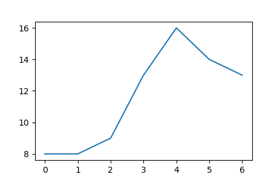

2019年1月2日随时间的温度变化 ：

温度：8,8,9,13,16,14,13 

时间：2,5,8,11,14,17,20

```python
import matplotlib.pyplot as plt

temp=[8,8,9,13,16,14,13]
tick=[2,5,8,11,14,17,20]
plt.plot(tick,temp)
plt.show()
```


## 18.3 条形图：

 **plt.bar(x, y)**

成绩对比图
姓名：张三，李四，王五
成绩：98，75，86

```python
import matplotlib.pyplot as plt

plt.rcParams['font.sans-serif'] = ['SimHei']      #支持中文，防止乱码

students=['张三','李四','王五']
scores=[98,75,86]
plt.bar(students, scores)
plt.title('学生成绩分析图')
plt.show()
```

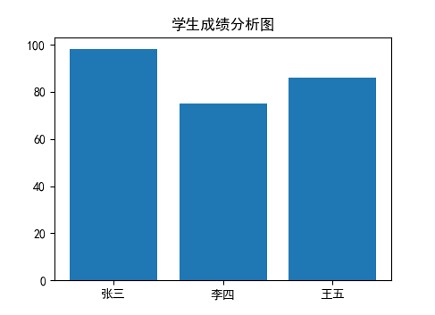

## 18.4 饼   图：

**plt.pie(percent, labels,autopct)**

percent 百分比例数据列表
labels  名称对应列表
autopct 显示百分比方式

根据成绩等级数据，绘制成绩分布图

| 成绩等级 | A    | B    | C    | D    | E    |
| -------- | ---- | ---- | ---- | ---- | ---- |
| 人数     | 5    | 30   | 50   | 10   | 5    |

```
import matplotlib.pyplot as plt

score=[5,30,50,10,5]
grade=['A','B','C','D','E']
plt.pie(score,
        labels=grade,
        autopct='%.1f%%')
plt.title('Score Chart')
plt.show()
```


其他图表函数详细使用请查阅课外资料
散点图：plt.scatter(x, y)
直方图：plt.hist(h)
热力图：plt.imshow(a)

## 18.5 绘制正弦函数
​		**NumPy**是用Python进行科学计算的基础包，支持维度数组运算、矩阵运算及提供大量的数学函数库。
​		**安装方法**：
​		pip install numpy

```python
import matplotlib.pyplot as plt
import numpy as np

plt.rcParams['font.sans-serif'] = ['SimHei']
pai =np.pi
x = np.arange(0,2*pai,0.01)
y = np.sin(x)
plt.plot(x,y)
plt.title('正弦函数')
plt.show()
```

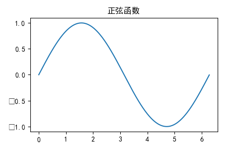

## 18.6 绘制二次函数

```python
import matplotlib.pyplot as plt
import numpy as np
#从-100-----100之间等间隔采600个数，画出来的图形就是用600个点连接形成的。
#点数过小会导致画出来曲线不平滑
x = np.linspace(-100, 100,600)

# 绘制x^2+2x+1函数的图像
y = x*x + 2*x + 1
plt.plot(x,y)
plt.show()
```


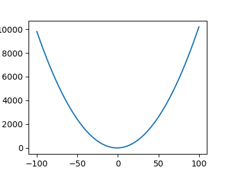


---

# 第十九课 网站开发

## 19.1 Bottle框架
   		**Bottle框架**只有一个Python模块文件，短小精悍，五脏俱全，且不依赖于任何第三方库。
   		**安装方法
   		pip install bottle
   		**使用示例** 

```python
from bottle import route, run      #导入bottle库的路由route和run运行模块

@route('/')                        #定义访问路由，斜杠/表示网站根目录
def hello():                       #定义上一行访问路由对应的响应函数，返回显示内容
    return "Hello World!"


run(host='localhost', port=8080)   #运行:host表示网址,port表示端口
```

​		运行程序后，交互式解释器会提示访问网址

> Bottle v0.12.18 server starting up (using WSGIRefServer())...
> Listening on http://localhost:8080/
> Hit Ctrl-C to quit.

​		请点击网址 http://localhost:8080/  我们就可以看到一个只有一句欢迎词的网站首页。
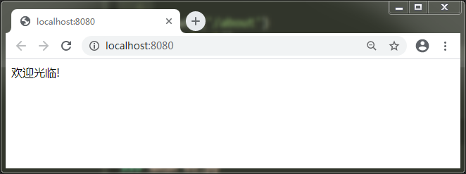

## 19.2 增加页面

​		我们只要再定义一个访问路由和相应的响应函数，就可以增加访问页面。 

现在我们来添加一个关于的页面，请在hello函数下面，添加**about函数**代码：

```python
@route('/about')
def about():
    return "关于我们"
```

​		运行后，点击网址 http://localhost:8080/ 访问网站首页
​		地址栏中输入http://localhost:8080/about  就可以访问关于页面了

​		

​		接下来，我们再增加一个内容的页面，请在about函数下面，继续添加**life函数**代码

```python
@route('/life')
def life():
    return "生活，就像一首歌儿。它包含着人生，多多少少的酸甜苦辣。 "
```


运行后，点击网址 http://localhost:8080/ 访问网站首页
然后在地址栏中输入http://localhost:8080/life 访问生活内容页面

最后，我们来添加导航栏目的内容，用字符串变量存储导航的html代码

```python
head="<a href='/'>首页</a> <a href='/life'>生活</a> <a href='/about'>关于</a><hr/><br>"
```

完整代码：

```python
from bottle import route,run

head="<a href='/'>首页</a> <a href='/life'>生活</a> <a href='/about'>关于</a><hr/><br>"

@route('/')
def hello():
    return head+ "欢迎光临!"

@route('/about')
def about():
    return head+ "关于我们"

@route('/life')
def life():
    return head+ "生活，就像一首歌儿。它包含着人生，多多少少的酸甜苦辣。 "

run(host='localhost', port=8080)
```

​		运行后，点击网址 http://localhost:8080/ 访问网站，一个简单小巧的网站创建成功了！

​		请点击导航文字，跳转到相应的页面，你还可以继续增加更多的页面。


​		Bottle库还支持模板和简单的数据库访问，更详细的内容，请访问官网 http://bottlepy.org


----


# 第二十课 GUI图形界面


## 20.1 Tkinter库

*Tkinter*是Python自带的图形用户界面库(Graphical User Interface 简称 GUI)

**使用方法**：from tkinter import *         导入GUI库

**创建窗体**：win=Tk()                                创建一个窗体实例

**窗体标题**：win.title('程序名称')

**常用的窗口部件**：

　　Lable：标签
　　Button：按钮
　　Entry：输入框
　　Text：文本框
　　Checkbutton: 多选框
　　Menu:菜单栏
　　Radiobutton: 单选框
　　Scrol lbar：滚动条

**定义窗口部件示例**：

----

**定义标签部件**： lb=Label(win,text='Typing',width=20, font=('微软雅黑', 24))

标签语法说明：标签变量 =  Label(窗体 , 文字='内容', width=宽度，font =（'字体'，字号）)

**定义标签位置**：lb.grid(row=0, column=0, padx=10, pady=24)

定位语法说明：标签变量.网格（row=几行 , column=几列，padx=左边距，pady=上边距）

**定义按钮部件**：btn=Button(win, text='开始打字', width=10, command=Start)

按钮语法说明：按钮变量=Button(窗体 , text='按钮名称' , width=宽度 , command=响应函数名)

**定义文本框部件**： et = Entry(win, textvariable=b, width=20, font=('宋体', 20))

文本框语法说明：文本框变量=Entry(窗体 , textvariable=内容变量 , width=宽度 , font=('字体', 字号))

----

## 20.2 第一个Tkinter程序

```python
from tkinter import *

win=Tk()
win.title('我的第一个Tkinter程序')
lb=Label(win,text='你好，世界！',width=20, font=('微软雅黑', 24))
lb.grid(row=0, column=0, padx=10, pady=24)

win.mainloop()
```


## 20.3 打字练习程序

我们打算编写一个打字练习的小程序。首先设计窗体：

```python
from tkinter import *
from datetime import datetime

win=Tk()
win.title('Typing 打字练习 by 温州水乡')
lb=Label(win,width=20, font=('微软雅黑', 24))  #定义lb标签，用来显示英文单词
lb.grid(row=0, column=0, padx=10, pady=24)

#定义开始按钮事件的响应函数
def Start():
    pass   

#定义结束按钮事件的响应函数
def Stop():
    pass  

#定义文本框，b为文本框的内容变量，方便读取和存储
b=StringVar()       
et = Entry(win, textvariable=b, width=20, font=('宋体', 20))
et.grid(row=1, column=0, padx=10, pady=20)

#定义开始按钮
btnStart=Button(win, text="开始打字", width=10, command=Start)  
btnStart.grid(row=3, column=0, sticky=W, padx=30, pady=5)

#定义结束按钮
btnStop = Button(win, text="停止打字", width=10, command=Stop, state='disable')
btnStop.grid(row=3, column=0, sticky=E, padx=30, pady=5)

mainloop()
```

运行程序，我们可以看到这样的一个程序界面

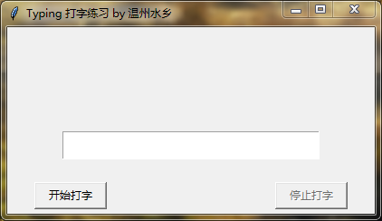

然后增加单词显示，我们可以用列表定义单词库，请添加下面的代码：

```python
english=['apple','dog','cat','mouse','fish','egg','food']
ln=len(english)            #读取列表长度，获取单词个数
```

为了能够计算打字的速度，我们还需要定义一个统计打完的单词个数变量和一个记录开始打字时间变量。

窗体部件的响应函数与主程序之间传递数据，我们要用Tkinter变量，请添加下面的代码：

```python
count=IntVar()     #单词个数变量，默认初始为0，InterVar表示整型
time=StringVar()   #开始打字时间变量，默认为空，StringVar表示字符串型
```

接下来，我们把开始打字的响应函数中的pass占位符删除，换成如下代码：

```python
#定义开始按钮事件的响应函数
def Start():    
    count.set(0)                      #将Tkinter变量count设置为0
    lb.configure(text=english[0])     #将lb标签内容设置为列表中的第一个英文单词
    begintime = datetime.now().strftime('%Y-%m-%d %H:%M:%S')  #读取当前时间
    time.set(begintime)               #将Tkinter变量time设置为当前时间
```

运行程序，我们可以看到程序窗体上显示出英文单词

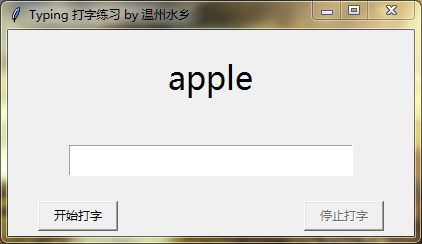

输入文字按回车后，如何跳到下一个单词呢？我们需要给文本框绑定回车键事件和响应函数

找到文本框et的代码，在其后面添加下面的代码：

```python
et.bind('<Return>',dazhi)   # 绑定Return回车键事件和响应函数dazhi
```

在Stop函数的后面，增加dazhi函数，代码如下 ：

```python
def dazhi(event):
    n=count.get()                       #取已打单词个数变量中的值
    m=n%ln               #取模，防止已打个数超过单词库时，循环显示单词
    word=english[m]	                    #读取单词库中的单词
    answer=b.get()	                    #读取输入文本框的文字
    if word==answer:        	        #如果两者相等
        n=n+1	                        #已打单词个数加1
        count.set(n)	                #已打单词个数变量保存当前值
        m=n%ln	                        #取模，防止超出单词库列表范围
        lb.configure(text=english[m])	#显示下一个单词
        b.set('')	                    #输入文本框清空内容
```

运行程序后，点开始打字，如果输入正确，将会跳转到下一个单词

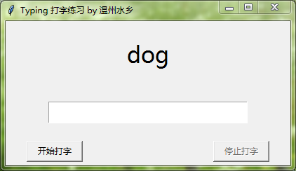

点击停止打字，需要显示刚才的打字速度，那么我们还要在Stop结束函数中增加打字速度的计算代码，请将Stop函数中的pass占位符删除，替换如下代码：

```python
def Stop():
    stoptime=datetime.now()              #获取打字结束的时间
    
    startime=time.get()                  #读取原来保存的打字开始的时间
    startime=datetime.strptime(startime,'%Y-%m-%d %H:%M:%S') #字符串转时间格式
    tick=(stoptime-startime).seconds     #时间相减后用秒为单位表示

    n=count.get()                        #读取原来保存的打字个数
    speed =n*60//tick                 #每分钟速度=打字个数*60/秒数
    msg=str(speed)+'个/分钟'           
  
    lb.configure(text=msg)
```

运行程序，打字完成后显示如下


​		开发轻量级的小工具，我们使用Tkinter图形界面库会非常的省事。Python自带的IDLE 就是使用 Tkinter 实现 ，本书推荐的Thonny IDE集成开发工具也是用Tkinter GUI开发的。使用Tkinter开发的程序，还可以使用PyInstaller打包封装成windows应用程序exe格式，方便发布和使用。

**打字程序完整源代码**

```python
from tkinter import *
from datetime import datetime

win=Tk()
win.title('Typing 打字练习 by 温州水乡')
english=['apple','dog','cat','mouse','fish','egg','food']
ln=len(english)
begin=0
lb=Label(win,width=20, font=('微软雅黑', 24))
lb.grid(row=0, column=0, padx=10, pady=24)
count=IntVar()
time=StringVar()

def Start():
    count.set(0)
    lb.configure(text=english[0])
    btnStart['state'] = 'disabled'  
    btnStop['state'] = 'normal'
    startime=datetime.now().strftime('%Y-%m-%d %H:%M:%S')
    time.set(startime)
    print(startime,'start')
    et.focus()    

def Stop():
    btnStart['state'] = 'normal'  
    btnStop['state'] = 'disabled'
    stoptime=datetime.now()
    print(stoptime,'stop')
    startime=time.get()
    startime=datetime.strptime(startime,'%Y-%m-%d %H:%M:%S')    
    tick=(stoptime-startime).seconds
    #print('耗时',tick,'秒')
    n=count.get()
    #print('正确数',n,'个')
    speed =n*60//tick
    msg=str(speed)+'个/分钟'
    #print(msg)    
    lb.configure(text=msg)
    btnStop.focus()
    
def dazhi(event):
    n=count.get()
    m=n%ln
    word=english[m]
    answer=b.get()
    if word==answer:        
        n=n+1
        count.set(n)
        m=n%ln
        #print(m)
        lb.configure(text=english[m])
        b.set('')

b=StringVar()
et = Entry(win, textvariable=b, width=20, font=('宋体', 20))
et.bind('<Return>',dazhi)
et.grid(row=1, column=0, padx=10, pady=20)

btnStart=Button(win, text="开始打字", width=10, command=Start)
btnStart.grid(row=3, column=0, sticky=W, padx=30, pady=5)
btnStop = Button(win, text="停止打字", width=10, command=Stop, state='disable')
btnStop.grid(row=3, column=0, sticky=E, padx=30, pady=5)

mainloop()
```

​		读到这里已经到了本书的结尾，相信你已经掌握了python的基础语法并学会了各方面的简单应用。如果想要深入学习请查阅Python和学习库官网文档或更详细的专业书籍。

