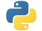

#  Python 自学手册

## 前言

​		**Python**是一门很有趣且实用的计算机语言。Python入门很容易，通过本书的实例学习，可以很轻松地掌握Python的一些基本语法，并且能够编写一些简单的应用程序。

​		**本书内容**：

​		前1~9课为语法部分，使用交互解释器学习python语言的基本语法。

​		后10~20课为应用部分，使用编辑器编写小段程序，掌握常用的python内置函数、模块和库。

​		**学习建议**：

​		编程通俗地讲，就是书写处理字符串和数字的代码。本书作为自学手册，有很多概念和描述不够细致，不能单独作为入门教程来使用，请初学者阅读相关基础教程，配合使用最佳。本书缺少数据库、视觉识别、科学计算方面的介绍，主要是因为难度太深，需要更多相关知识支持，不适合入门学习。本书使用Thonny IDE工具学习Python，所以不再细数Python自带的IDLE、Pycharm edu版和VsCode编辑器等。

---

笔名：温州水乡 初中信息技术教师  2020年2月8日  版权保留，请勿转载！

众志成城，抗击疫情，万众一心，春暖花开！

## 点击在线学习:  [Python自学手册](https://github.com/WaterCountry/Pyhandbook/Python自学手册.html)

----
